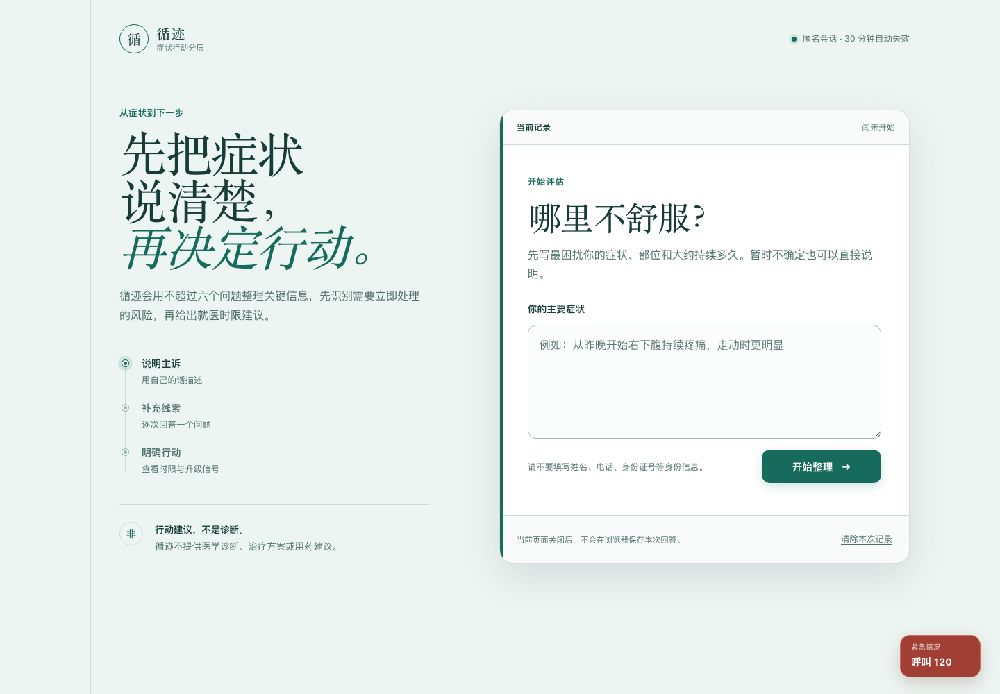
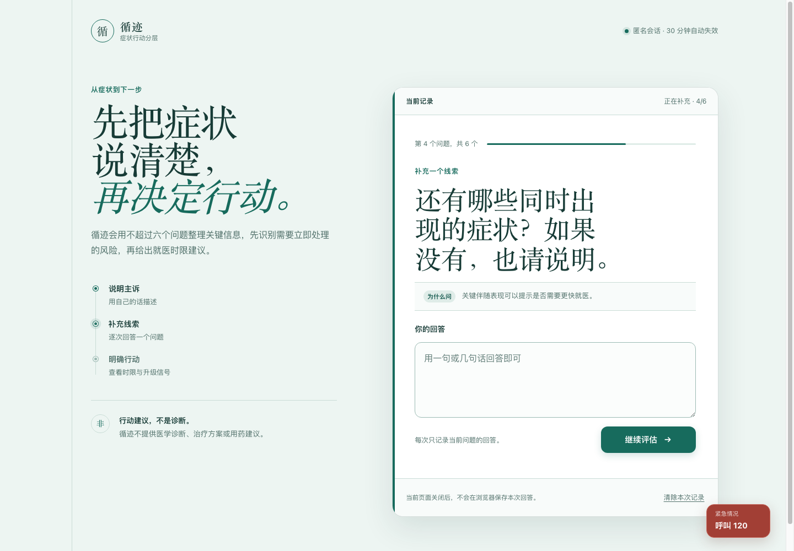
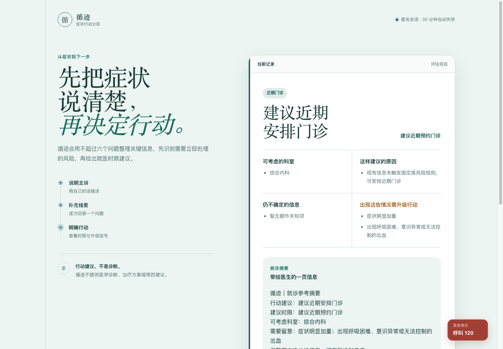
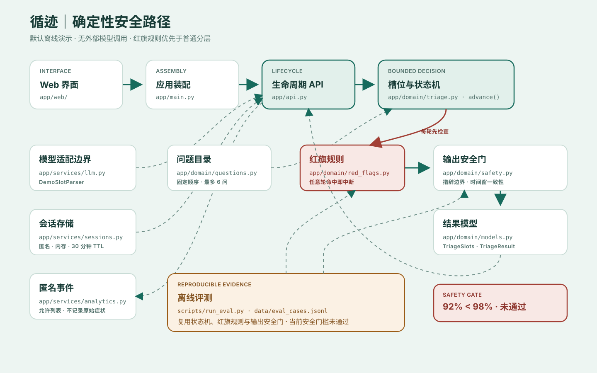

# 循迹 · Xunji

**不是诊断工具。** 循迹是一个中文健康行动分层作品集原型：它用固定红旗规则、最多 6 个有界追问和结构化结果，帮助演示“现在该采取什么行动”，不提供疾病诊断、治疗方案或用药建议。

> [!CAUTION]
> **安全门槛未通过。** 当前合成产品测试集的红旗召回率为 **92%（46/50）**，低于预先声明的 **98%** 安全门槛。该结果不支持上线、临床使用或医疗有效性声明。

> [!NOTE]
> **作品集状态：实现演示已就绪，产品验证未完成。** 代码、交互、评测和产品文档可供审阅；计划中的 3–5 次用户访谈与任务测试尚未开展，因此不声称已验证需求、可用性或信任。

## Demo 截图

以下截图来自本仓库实际运行的本地应用；演示文本均为完全虚构的合成输入，不对应真实患者。



**有界追问**



**结构化行动结果**



## 问题与取舍

症状搜索常给出一串“可能原因”，却没有回答何时、去哪、做什么。循迹把目标收窄为行动清晰度，并明确承担以下取舍：

| 选择 | 得到什么 | 失去什么 |
| --- | --- | --- |
| 固定红旗规则优先于开放对话 | 每轮可重复、可审计地中断高风险流程 | 词组规则会漏掉口语变体和错别字 |
| 最多 6 个槽位追问 | 问题数量有上限，信息不足时明确停止 | 不会“问到看起来完整为止” |
| 结构化结果优先于自由回答 | 行动等级、时限、未知项和升级信号可验证 | 不生成疾病解释或个性化治疗文本 |
| 本地 `DemoSlotParser` 优先于外部模型 | 无 API 密钥也可运行、测试和评测 | 当前自然语言解析能力刻意受限 |

## 核心流程

```text
虚构主诉输入
  → 更新有限槽位与跨轮安全证据
  → 每轮先检查固定红旗
      ├─ 命中：立即中断普通流程，显示固定 120 急救入口
      └─ 未命中：追问一个缺失槽位（最多 6 问）
  → 生成行动等级或降级为信息不足
  → 输出安全门检查诊断、剂量、治疗措辞和时间窗
  → 前端渲染固定字段与就诊参考摘要
```

行动等级只有 `emergency`、`urgent`、`routine`、`self_monitor` 和 `insufficient`。任何一轮新出现的红旗都可以把流程升级为 `emergency`，普通分层不能将其降级；已识别的孕产、慢性病或近期外伤等风险背景会阻止系统给出短期自我观察，并改用更保守的近期门诊建议。

## Agent 架构



“Agent”在这里指受约束的状态流程，不是一个自由生成答案的医生人格。默认 `DemoSlotParser` 只位于“用户语言 → 槽位”的适配边界；红旗、行动分层和结果校验都留在确定性领域逻辑中。组件与代码逐项映射见 [架构说明](docs/ARCHITECTURE.md)。

## 安全机制

- **红旗优先：** `advance()` 在每轮合并有限证据后先执行固定红旗规则，命中后停止常规追问。
- **有界降级：** 信息冲突、关键槽位缺失或达到问题上限时返回 `insufficient`，不补写推测。
- **输出安全门：** `validate_result()` 拒绝确定性诊断、剂量、治疗指令及与行动等级冲突的时间窗。
- **最少留存：** 匿名会话仅在进程内保存，默认 30 分钟过期；公开 API 不返回原始输入或私有安全证据，只返回允许列表中的归一化就诊摘要字段。
- **固定急救入口：** 急症状态使用前端固定的中国大陆 `tel:120`，并把键盘焦点移到行动标题。
- **失败可见：** 评测失败保留在报告中，不把合成测试结果改写为临床准确率。

## 真实评测结果

数据集 `1.1.0` 含 **120 条归一化后仍唯一的完全合成中文轮次序列**。评测脚本复用生产 `advance`、`detect_red_flags` 和 `validate_result`；这些标签是产品回归基准，不是临床金标准。

| 指标 | 当前结果 | 结论 |
| --- | ---: | --- |
| 红旗召回率 | **92.00%（46/50）** | **未达到 98% 安全门槛** |
| 行动等级准确率 | 90.00%（108/120） | 未设发布门槛 |
| 边界措辞通过率 | 90.00%（108/120） | 未设发布门槛 |
| 失败案例 | 12 | 4 条红旗变体漏检；8 条未产生预期轻症结果 |

完整口径、类别分布和逐条失败原因见 [评测说明](docs/EVALUATION.md) 与 [最新评测快照](eval-results/latest.md)。

## 快速开始

要求 Python 3.12+。以下命令均从克隆或解压后的仓库根目录运行。默认演示模式完全本地运行，**不需要 API 密钥，也不会调用外部模型服务**。

```bash
uv sync --group dev
uv run uvicorn app.main:app --reload
```

打开 <http://127.0.0.1:8000>。健康检查应返回 `{"status":"ok","mode":"demo"}`：

```bash
curl http://127.0.0.1:8000/api/health
```

没有安装 `uv` 时，可使用标准虚拟环境：

```bash
python3.12 -m venv .venv
source .venv/bin/activate
python -m pip install "fastapi>=0.121,<1" "uvicorn>=0.38,<1" \
  "pydantic>=2.12,<3" "pytest>=8,<9" "httpx>=0.28,<1"
uvicorn app.main:app --reload
```

可复制的合成演示入口：

| 路径 | 输入文本 |
| --- | --- |
| 普通就医 | `虚构演示：今天开始咳嗽，4分，同时有流鼻涕，保持不变，没有慢性病。` |
| 明确红旗 | `虚构演示：胸痛，同时呼吸困难。` |
| 信息不足 | `虚构演示：今天开始头痛，2分，同时头晕，一会儿加重一会儿好转，没有慢性病。` |

运行完整检查：

```bash
uv run pytest -q
uv run python scripts/run_eval.py \
  --input data/eval_cases.jsonl \
  --output eval-results/latest.md
```

## 项目结构

```text
app/
├── web/           # 单页界面与前端状态
├── domain/        # 红旗、问题、状态机、结果模型与安全门
├── services/      # 槽位适配边界、匿名会话与允许列表事件
├── api.py         # 会话、消息、删除与固定标签反馈 API
└── main.py        # FastAPI 装配与静态资源
data/              # 120 条完全合成的评测案例
scripts/           # 离线评测入口
tests/             # API、领域、安全、评测与 Web 契约测试
docs/              # 产品、研究、架构、评测与案例复盘
eval-results/      # 可审计的最新评测快照
```

## 产品文档

- [PRD](docs/PRD.md)：问题、范围、状态与验收边界
- [用户研究包](docs/USER-RESEARCH.md)：尚未执行的访谈与任务测试方案
- [架构说明](docs/ARCHITECTURE.md)：组件、请求路径、隐私与失败降级
- [评测说明](docs/EVALUATION.md)：数据口径、指标定义与失败分析
- [Case Study](docs/CASE-STUDY.md)：产品取舍、证据追溯与复盘
- [产品真相](PRODUCT.md) 与 [设计系统](DESIGN.md)：能力边界和“诊室行动记录页”视觉规则

## 已知限制

- 4 条错别字或变体隐晦红旗未被固定词组命中，当前安全门槛明确未通过。
- 8 条短期观察测试未得到最终结果，暴露了时间表达抽取和槽位去重缺口。
- 默认 `DemoSlotParser` 不是通用自然语言理解模型；它只提供保守的离线适配边界。
- 会话、事件和反馈均为单进程内存实现，不适合部署或长期存储。
- 评测全部来自合成案例；没有真实患者数据、临床审查、外部验证或已完成的用户研究。
- 急救入口固定为中国大陆 `120`，尚未实现地区识别或本地化紧急服务。

## 路线图

1. 修复 4 条红旗变体漏检和 8 条轻症无结果，并为每个缺口增加回归案例。
2. 重跑完整评测；在红旗召回达到预设 98% 门槛前保持“未通过”状态。
3. 邀请合格临床人员独立审查高风险规则、边界和测试方案。
4. 完成 3–5 名目标用户的访谈与任务测试，再评估隐私、安全和真实使用范围。

## 免责声明与许可证

本仓库仅用于产品与技术演示，**不是医疗器械、医疗服务或医疗建议**，不会建立医患关系，也不能替代合格医疗专业人员的评估。若你或他人可能处于紧急情况，请立即联系所在地急救服务；在中国大陆请拨打 `120`。请阅读完整的 [医疗免责声明](MEDICAL_DISCLAIMER.md)。

代码按 [MIT License](LICENSE) 发布。
