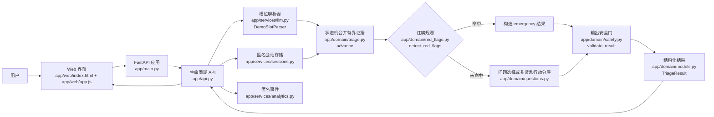
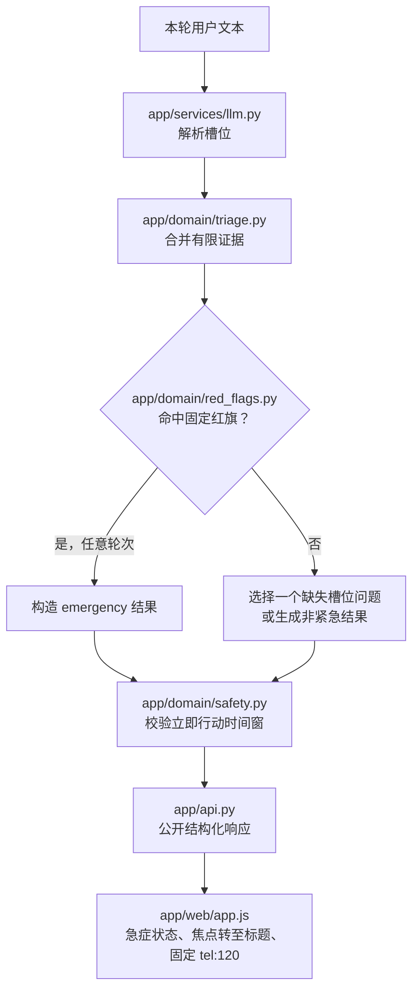

# 「循迹」架构说明

## 1. 设计结论

当前原型把安全关键路径放在确定性领域逻辑中：API 先用 `SlotParser` 更新槽位，再由状态机合并有界的跨轮证据；红旗筛查是状态机内最高优先级的决策，发生在问题选择和非紧急行动分层之前，最终结果再经过输出校验。默认演示模式不调用外部模型，因此离线 Demo 和离线评测复用同一条生产状态机路径。

该架构用于展示产品安全边界，不构成医疗系统架构或临床验证。当前 120 条完全合成案例的红旗召回率为 92%（46/50），低于预设 98% 门槛；系统不可被描述为可投入实际医疗使用。

## 2. 组件与代码映射

| 组件 | 当前文件 | 职责 |
| --- | --- | --- |
| Web 界面 | `app/web/index.html`、`app/web/app.js` | 输入、追问、急症/结果/错误状态、复制摘要、反馈和清除。 |
| 应用装配 | `app/main.py` | 创建 FastAPI、静态资源、会话、事件记录器和解析器。 |
| 生命周期 API | `app/api.py` | 创建/追加/删除匿名会话，提交固定标签反馈，输出公开响应。 |
| 模型适配边界 | `app/services/llm.py` | `SlotParser` 协议与默认 `DemoSlotParser`。 |
| 会话存储 | `app/services/sessions.py` | 内存匿名会话、30 分钟 TTL、读取/更新/删除。 |
| 红旗规则 | `app/domain/red_flags.py` | 固定词组级高风险匹配，返回 `RedFlagMatch`。 |
| 槽位与状态机 | `app/domain/triage.py` | 证据窗口、红旗优先、有界追问、行动分层和信息不足降级。 |
| 问题目录 | `app/domain/questions.py` | 六个固定槽位问题及其选择顺序。 |
| 结果模型 | `app/domain/models.py` | `TriageSlots`、`TriageResult`、行动等级与免责声明。 |
| 输出安全门 | `app/domain/safety.py` | 诊断/剂量/治疗措辞及时间窗口一致性检查。 |
| 匿名事件 | `app/services/analytics.py` | 允许列表的生命周期与反馈事件。 |
| 离线评测 | `scripts/run_eval.py`、`data/eval_cases.jsonl` | 运行同一领域接口并生成审计报告。 |

## 3. 正常请求路径



实际顺序是：解析当前文本并更新槽位 → 状态机合并有限证据 → 红旗检查 → 选择下一问题或生成结果 → 输出校验。`app/api.py` 只返回 `SessionResponse`/`PublicTriageResult`，不把原始用户消息、私有安全证据或内部推理直接暴露给浏览器。

## 4. 红旗中断路径

红旗规则会在首轮和后续轮次运行。它可以从有限跨轮用户证据中组合信息；例如，前一轮提到胸痛、后一轮提到呼吸困难时，状态机仍应转入紧急状态。已经完成的普通会话继续接受红旗检查，以避免后续新证据被忽略。



紧急路径不继续提出常规问题。它只呈现固定的立即行动入口与免责声明，避免用长篇解释分散用户注意力。红旗规则的紧急状态不能被普通分层逻辑或任何槽位解析结果降级。

## 5. 槽位、状态与结果契约

`TriageSlots` 保存主症状、起始时间、趋势、严重程度、伴随症状与风险因素。`QUESTION_CATALOG` 的当前固定顺序为：主症状、起始时间、严重程度、伴随症状、趋势、风险因素；`MAX_QUESTIONS` 为 6。风险背景不用于推断疾病，但会阻止 `self_monitor`，将最低行动等级保守提升为 `routine`。

状态机还维护：匿名 `session_id`、已问问题、问题计数、完成状态、下一题、最终结果、最多 8 轮且每轮最多 240 字的私有安全证据，以及未解决槽位标记。若信息不足、冲突或在问题上限后仍不能可靠分层，则产生 `insufficient`，而不是填补推测。

`TriageResult` 固定要求以下字段：

```text
urgency_level, time_window, department, reasoning_summary,
unknowns, escalation_signs, visit_summary, disclaimer
```

行动等级只有 `emergency`、`urgent`、`routine`、`self_monitor` 和 `insufficient`。前端根据这些固定字段渲染，而不是直接渲染任意自由文本；可复制摘要只使用允许列表中的归一化症状、时间、严重程度、伴随表现、趋势和风险背景，急症路径不回显症状原文。

## 6. 默认演示模式与模型适配器

`app/services/llm.py` 定义 `SlotParser` 协议，边界仅限于把用户语言解析为 `TriageSlots`。未来可在该协议后替换受控的槽位解析实现，但它不负责生成结果或面向用户的回答。当前 `build_slot_parser()` 无论环境变量如何都返回本地 `DemoSlotParser`：它仅把当前文本保守地保存为主症状，不发起网络请求。

这个边界的意义是：

- Demo、单元测试和离线评测无需 API 密钥，行为可重复。
- 高风险规则、行动等级和输出校验不依赖模型服务可用性。
- 未来基于模型的实现只能改善口语到槽位的解析；解析后的槽位仍由同一红旗优先级、状态约束和安全门处理。
- 接入模型前需定义超时、审计、数据处理协议、对抗回归和人工复核；目前这些不是已实现能力。

## 7. 输出校验与失败降级

`validate_result()` 会检查最终结构化结果的全部文本字段。当前拒绝确定性诊断表达、剂量表达和治疗指令；同时检查行动等级是否配有相应时间窗，并阻止紧急结果出现延迟就医表达。

| 失败或异常 | 当前行为 | 设计目的 |
| --- | --- | --- |
| 红旗命中 | 立即输出 `emergency`，不再常规追问 | 优先处理高风险。 |
| 槽位不足/冲突 | 输出 `insufficient` | 不用猜测补齐。 |
| 达到 6 问仍无法分层 | 输出 `insufficient` | 限制追问并转人工确认。 |
| 输出校验抛错 | 结果不会成为已验证公开结果 | 阻断违背边界或时间窗的输出。 |
| 网络、会话过期或响应不完整 | `app/web/app.js` 保留填写内容，提供重试或返回修改 | 减少输入丢失与盲目重试。 |
| 未来模型槽位解析器故障 | 默认模式没有模型调用；接入后必须回到保守本地/人工路径 | 避免把外部依赖故障伪装成正常建议。 |

当前代码没有“自动改写一次输出后再发布”的模型重试实现；文档不将该策略描述为既有功能。

## 8. 隐私与日志边界

系统不要求账号或直接身份字段。会话 ID 是匿名 UUID；会话只保存在进程内，默认 30 分钟后到期，用户可调用删除接口。为安全检查而临时保留的用户文本证据仅在 `TriageSession` 私有字段中有界保存，API 响应不返回该字段。

`EventRecorder` 的事件是允许列表：`session_created`、`message_received`、`session_deleted`、`feedback_submitted`。事件只包含匿名会话 ID、问题 ID、问题数、行动等级、固定反馈标签/是否有帮助和时间戳；不包含原始症状文本、API 密钥或自由文本反馈。当前事件记录器在内存中，未实现长期日志管道。

前端把 API 文本写入 `textContent`，不将用户输入作为 HTML 插入，降低脚本注入风险。产品仍需在任何真实部署前完成独立的安全、隐私、访问控制、监控和保留期审查。

## 9. 评测与已知限制

`data/eval_cases.jsonl` 含 120 条唯一、完全合成的中文轮次序列；`scripts/run_eval.py` 复用生产 `advance`、`detect_red_flags` 和 `validate_result`。当前结果：红旗召回率 92%（46/50）、行动等级准确率 90%（108/120）、边界措辞通过率 90%（108/120）、12 条失败案例。

四条错别字/变体隐晦红旗未被固定词组捕获；八条短期观察案例没有产生最终结果。测试标签是产品回归基准，不是医学诊断金标准，不能推导临床敏感度、特异度或真实患者结局。修复规则、解析或适配器后，必须先在完整合成集合及新增回归例上重新评测。
