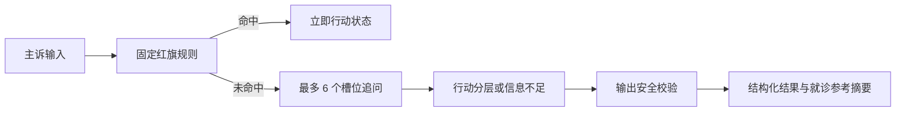

# Case Study｜循迹：把健康问答收敛为可验证的行动分层

## 项目摘要

「循迹」是一个健康行动分层作品集原型：用户以中文描述不适，系统先检查固定红旗，再进行有限追问，最后输出行动等级、时间窗口、可考虑科室、未知项和就诊参考摘要。它不提供疾病诊断、患病概率、处方、剂量或治疗方案。

本项目的目标不是把通用聊天做得更像“医生”，而是验证一个更受约束的问题：当用户不知道下一步该做什么时，怎样用可审计的流程帮助其整理行动，同时把高风险边界放在最前面。

## 问题

用户搜索症状时经常获得一串可能原因，却仍无法判断是否紧急、何时去哪里就医、就诊前要准备什么。对健康场景而言，直接生成貌似确定的答案会放大误解：用户可能把通用信息误读成个人诊断，也可能在高风险表现下被冗长对话拖慢。

因此我把用户价值定义为“行动清晰度”，而非“猜中疾病”。原型首先服务于需要在有限时间内整理信息、做出下一步决策的移动端用户；这是一项探索性产品判断，尚未由访谈验证。

## 取舍

### 取舍一：安全规则优先于开放式对话

固定红旗规则覆盖心肺高风险、疑似卒中、严重过敏、大量出血、意识/抽搐和自伤表达。代价是词组级规则不擅长口语变体和错别字；收益是每轮都能用相同逻辑复现和审计紧急中断。

### 取舍二：有限追问优先于“问到足够为止”

原型仅追问主症状、起始时间、严重程度、伴随症状、趋势和风险因素，最多 6 个问题。信息不足或矛盾时输出 `insufficient` 并转向人工医疗确认，而不是生成看似完整的建议。

### 取舍三：结构化结果优先于自由格式回答

结果固定为行动等级、时间窗、科室、理由、未知项、升级信号、就诊摘要和免责声明。前端渲染固定字段；安全门拒绝诊断、剂量、治疗措辞以及与行动等级冲突的时间窗。

### 取舍四：可重复 Demo 优先于外部模型依赖

默认模式使用本地 `DemoSlotParser`，不调用模型 API。这样离线评测、单元测试和界面演示复用同一状态机；未来基于模型的适配器只可把用户语言解析为槽位，不能生成结果、覆盖红旗规则或跳过输出校验。

## 方案

体验被实现为一个响应式单页流程，包含开始、追问、急症、结果、信息不足和网络错误状态。急症状态使用固定 `tel:120` 入口并将键盘焦点移至标题；普通结果呈现已知信息、未知项和升级条件；请求失败时用户输入保留，可重试或返回修改。

后端采用 FastAPI 匿名会话 API；会话在内存中默认 30 分钟到期，可由用户清除。分析事件为允许列表，不记录原始症状文本或自由文本反馈。为支持跨轮红旗检查，状态机短时保存有界的私有安全证据，且不会经公开 API 返回。

## 验证

我建立了 120 条完全合成、归一化后仍唯一的中文产品测试案例，涵盖明确/隐晦红旗、常规就医、短期观察或健康焦虑、信息不足或冲突，以及边界/提示攻击。评测脚本复用生产 `advance`、`detect_red_flags` 和 `validate_result`，而不是另写一套演示逻辑。

这些是产品回归标签，不是医学诊断金标准。离线集合无法证明真实人群表现、临床敏感度/特异度或患者结局；用户访谈和可用性测试尚未完成。

## 结果

实际评测暴露了关键限制，而非支持发布：红旗召回率 92%（46/50），低于预设 98% 安全门槛，因此当前结论是**安全门槛未通过**。行动等级准确率与边界措辞通过率均为 90%（108/120），共有 12 个失败案例。

失败中有 4 条错别字/变体隐晦红旗未被固定词组命中；另有 8 条短期观察案例未产生最终结果，原因包括伴随症状与主症状去重后仍被视为缺失，以及“几小时前”未被当前起始时间提取识别。这些失败将直接成为下一轮回归用例，而不是被隐藏或改写为营销指标。

### 诚实的量化指标

- 在 120 条完全合成的产品测试案例中，红旗召回率为 **92%（46/50）**，未达到预设 **98%** 安全门槛。
- 行动等级准确率为 **90%（108/120）**；标签是当前产品规则的回归基准，不是临床金标准。
- 边界措辞通过率为 **90%（108/120）**，总计识别 **12** 条失败案例供回归修复。

## 证据可追溯性

| 作品集表述 | 可核对来源 | 不可由该来源推导的结论 |
| --- | --- | --- |
| 安全门槛未通过 | `docs/EVALUATION.md` 与 `eval-results/latest.md` 的 92%（46/50）红旗召回率 | 真实人群风险、临床有效性或可实际使用。 |
| 系统会有限追问并在信息不足时降级 | `app/domain/triage.py`、`app/domain/questions.py` | 用户一定理解追问或不会中途退出。 |
| 结果不应含诊断、剂量和治疗指令 | `app/domain/safety.py` 与其回归测试 | 所有自然语言变体均被覆盖。 |
| 默认模式不依赖外部模型 | `app/services/llm.py` 的 `DemoSlotParser` | 外部模型接入后的可靠性、成本或隐私表现。 |
| 界面支持复制摘要、反馈和清除 | `app/web/app.js`、`app/api.py` | 这些功能已被真实用户采纳或改善就医沟通。 |

这张表是案例叙述的边界：代码和合成评测可以证明原型的实现与当前回归结果，不能替代真实用户研究、临床审查或发布评估。

## 我负责的产品工作

- 将模糊的“健康问答”重新定义为行动分层任务，明确不做诊断、处方和长期健康档案。
- 设计红旗优先、有界槽位追问、结构化结果和信息不足降级的端到端状态路径。
- 规定模型适配器只能处于用户语言到槽位的解析边界，不能生成结果或绕过规则和输出校验。
- 建立合成案例的覆盖分类、指标口径和失败案例复盘方式，并把安全门槛未通过放在产品结论中。
- 编写后续访谈工具，用于验证用户对边界、追问和结果复述的理解；该研究仍计划开展。

## 复盘

第一，健康产品的“安全优先”不能停在免责声明上：红旗规则、状态机、时间窗校验、公开响应脱敏和回归集都需要成为可测试的产品能力。第二，确定性规则带来可审计性，却也暴露语言覆盖局限；错别字和口语变体的漏检说明在扩大范围前必须先增强规则、数据和独立审查。第三，产品流程即使功能完整，也不等于用户理解；“能否复述何时、去哪、做什么”仍需要通过 3–5 名目标用户的访谈和任务测试验证。

下一步的顺序是：先修复并回归红旗漏检与轻症信息抽取问题，重新评测直到满足安全门槛；再由合格临床人员审查高风险边界；之后完成用户研究，验证追问理由、隐私说明和结果复述。没有完成这些前提，不把原型描述为临床有效、可上线或已获得医生背书。

## 作品集阅读路径

1. 先阅读 [PRD.md](PRD.md)，了解问题、范围、当前实现与验收边界。
2. 再阅读 [ARCHITECTURE.md](ARCHITECTURE.md)，核对红旗中断、会话隐私和输出校验的实现位置。
3. 在 [EVALUATION.md](EVALUATION.md) 查看 120 条合成案例的口径、结果和失败分析。
4. 最后使用 [USER-RESEARCH.md](USER-RESEARCH.md) 的空白工具包开展访谈；在得到证据前不把假设写成结论。

## 简历描述（79 个中文字符）

设计并实现健康行动分层原型：以红旗规则优先的有界状态机驱动 6 问以内追问，输出结构化就诊准备信息；构建 120 条合成案例离线评测，识别红旗召回 92% 未达 98% 安全门槛，并据此规划规则与研究迭代。
